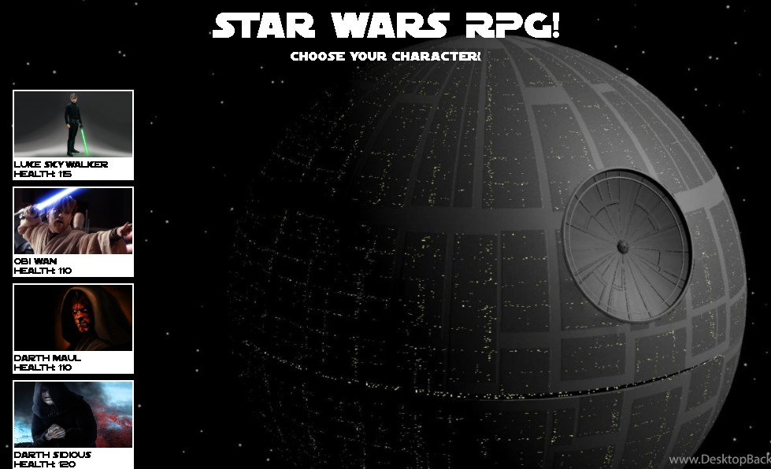

# unit-4-game
## Star Wars role playing game using jQuery

### Play the game here: [Star Wars RPG](https://curtislane.github.io/unit-4-game/)

### Directories:
* Root
    * [index.html](./index.html)
    * [assets](./assets)
        * [css](./assets/css)
            * [reset.css](./assets/css/reset.css)
            * [style.css](./assets/css/reset.css)
        * [favicon](.assets/favicon)
            * [favicon.ico](./assets/favicon/favicon.ico)
        * [font](./assets/font)
            * [sf_distant_galaxy](./assets/font/sf_distant_galaxy)
        * [images](./assets/images)
        * [javascript](./assets/javascript)
            * [script.js](./assets/javascript/script.js)

            

### Functions: 
    1. Message displayed to user: Choose your character.
        1a. Clicking any of the four images will select your character.
        1b. Selected character background turns green, all others become red.
    2. Message displayed to user: Choose your first enemy.
        2a. Clicking any of the three images with a red background will move that image to the enemy fighting area.
    3. Attack button appears, message displayed to user: Click the attack button.
        3a. Clicking the attack button reduces the enemy health by player attack power.
        3b. Player attack power increases with every attack.
        3c. Player health is then reduced by the amount of enemy counter attack power.
        3d. Enemy counter attack power does not change.
    4. If the enemy runs out of health before the player, message displayed to user: You defeated the firs (or 'second') enemy, choose your next enemy (or 'final opponent').
        4a. Enemy is moved back in line with other images and background turns gray.
        4b. Reset button appears which reloads the page.
    5. If the player runs out of health before the enemy, message displayed to user: You lose. Try again.
        5a. Player background becomes gray.
        5b. Reset button appears which reloads the page.
    6. If the player defeats all three enemies, message displayed to user: You win, Congratulations!
        6a. Reset button appears which reloads the page. 

